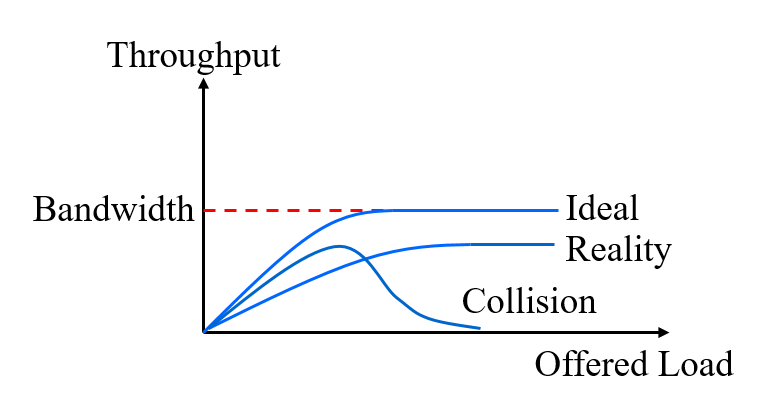
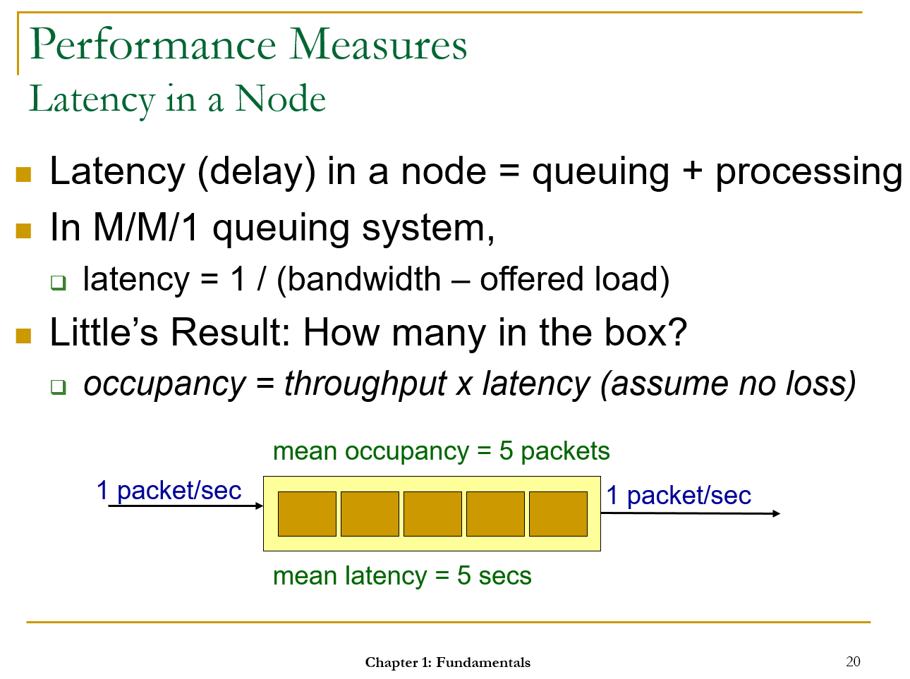
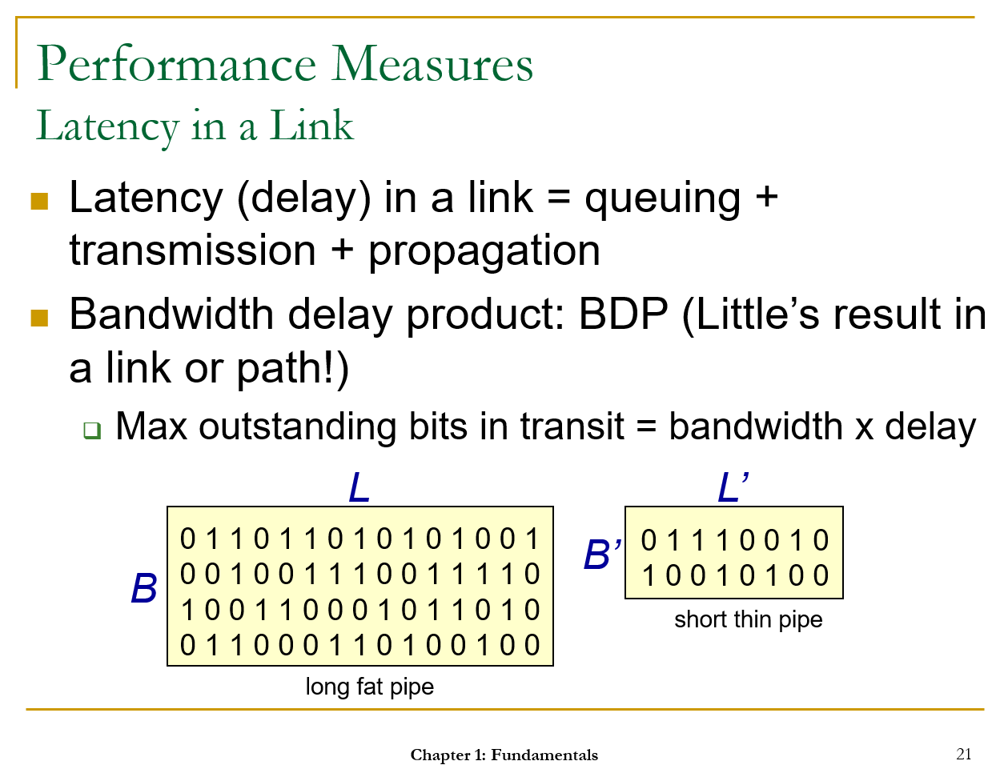
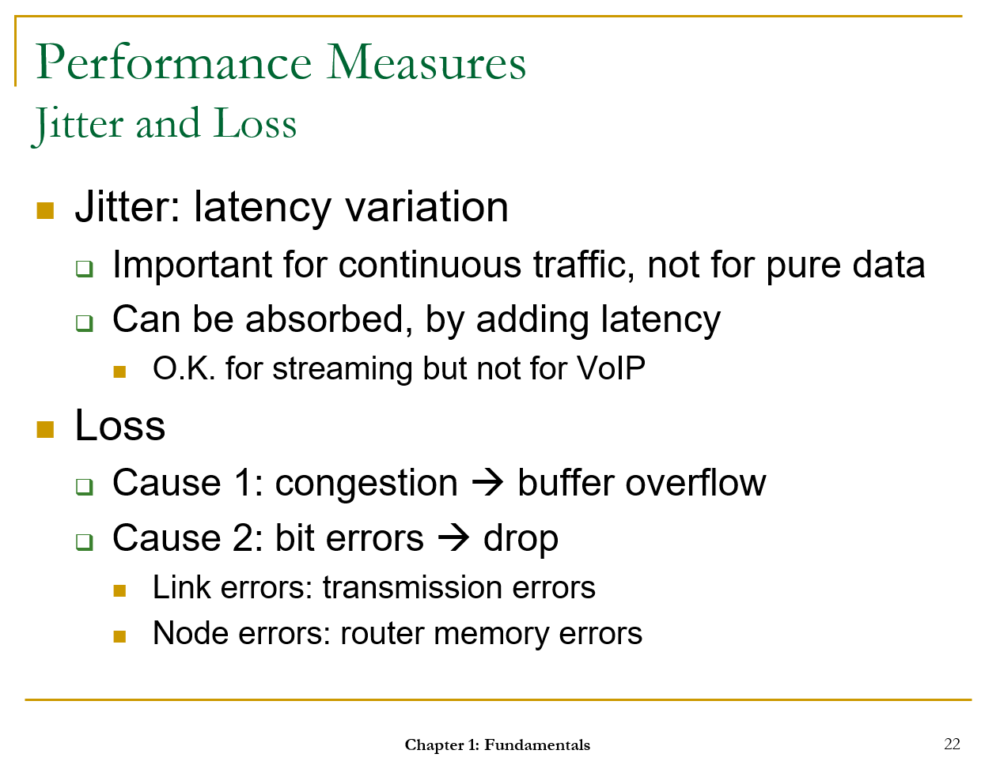
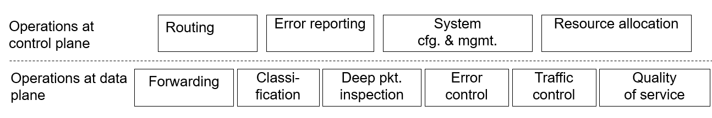
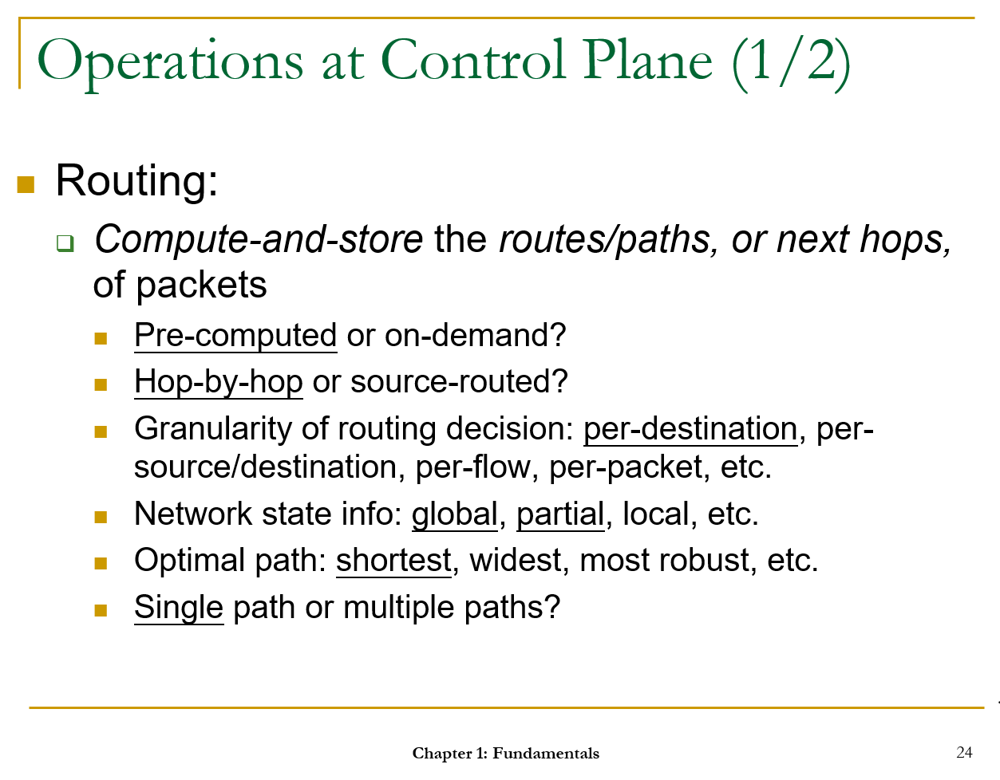
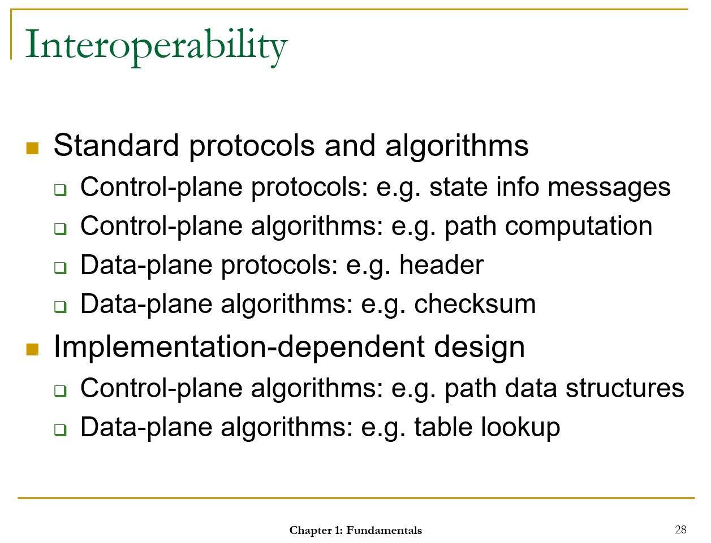

# NCTU-Computer-Networks
Notes and Assignment from the National Chiao Tung University (Taiwan) IOE5041 Computer Networks course

0. Introduction
=================

Course homepage: http://speed.cis.nctu.edu.tw/~ydlin/course/cn/mcn.html

1. Fundamentals
=================

1.1 Requirements
------------

**Requirements for Computer Networking**

Q: How do we frame a problem?
 >- objective: requirements
 >- constraints: principles

Q: What do we need to include in the solution
>- design: one architecture and many algorithms
>- implementation: code

Q: What do we ask about computer networks / 3 objectives of computer networks?
> - Connectivity: shared platform
> - Scalability: large number of users and applications
> - Resource-sharing: packet switching & circuit switching;  efficiency 
> *e.g. each party only talking half of the time on telephone calls*

**Connectivity: Node, Link, and Path (sequence of nodes and links)**

1. Node: host or gateway
- Host: end-point where users or applications reside
- Gateway: device to interconnect hosts

2. Link: point-to-point or broadcast
- Point-to-point: two end-points (full-duplex, half-duplex, simplex)
- Broadcast: many attach-points (need to contend for the right to transmit), normally shorter range

>Wired or Wireless
>- Wired: twisted pairs, coaxial cables, optics fiber etc
>- Wireless: radio, microwave, infrared, and beyond

3. Path: routed or switched
- Routed: stateless concatenation of links, [packet switching]
- Switched: stateful concatenation of links (hardstate vs softstate), [circuit switching]
*e.g. relationship state*

Switching is much faster than routing but at the cost of setup overhead (switching table)

 >- Circuit switching: indexing, telecom, eg ATM and phone call; switched
 >- Packet switching: matching, datacom, eg Internet and Skype call; routed

>Indexing is much faster than matching, but the overhead is that indexing needs to establish a much larger entry table. However, matching is more widely used, as matching has only the number of destinations as table entries, not the number of flows/connections as entries which is much larger. (In actual implementation, hashing is used to speed up the process).

>Circuit Switching Fall Back (CSFB): a compromise to handle both data and voice calls; propagation delay in packet switching *e.g. delay in international calls should be < 200ms, can be checked by ping or traceroute*

**Scalability: Number of Nodes**

Computer network: a scalable platform to *group* a *large* number of nodes so that each node *knows* how to reach any other node

*Hierarchy* of nodes (divide and conquer; currently 3-level;  4,000,000,000 nodes Internet, ~100,000 or 256*256=65,536 domain, and 256 destination sub-net etc), group by recursive clustering

LAN (local): broadcast link, switch
MAN (metropolitan): broadcast ring, routers
WAN (wide)

Intra-domain and inter-domain routing have different requirements for scalability, so the solutions will be different too

**Resource Sharing**

Computer network: a *shared* platform where the *capacities* of nodes and links are used to carry *communication* messages between nodes

Q: How to share?
> - Store-and-forward packet switching (vs circuit switching)
> - Packet the message (chop message into packets, header & payload)
> - Queuing/buffer, no blocking or dropping (vs circuit switching no queuing required, no packet loss or jitter/latency)
>  - at node: queuing/buffering and processing time
>  - at link: queuing/buffering, transmission, propagation time

bursty traffic, packet switching, possible congestion

1.2 Constraints / Underlying Principles
------------

 - Performance

 *quality of service*

	Keywords: Bandwidth, offered load, throughput, latency, jitter, loss

 - Operations

 *types of mechanisms*

	 - Operations at control plane **[managers]**

	Routing
	Traffic and Bandwidth Allocation

	 - Operations at data plane **[Assembly Line Workers]**

	Forwarding
	Congestion control
	Error control
	Quality of services

 - Interoperability (equipment from different vendors can operate together)

*what should be put into standard protocols and what should not*
	
	Standard protocols and algorithms
	Implementation-dependent (vendor-specific, can do it your own way)

**Performance Measures**

*Bandwidth*

Unit: 

 - MBps (million bytes per second)
 - Mbps (million bits per second)
 - Gbps (billion bits per second)

*Offered Load vs Throughput*

> Utilization: normalized offered load, bounded by 0 & 1 (but possible to exceed 1).
e.g. For a 10-Mbps link, an offered load of 5 Mbps means a normalized load of 0.5, meaning the link would be 50% busy on the average. 

- Offered Load: Input traffic
- Throughput: output traffic

The diagram shows a sub-linear relationship between offered load and throughput, with the non-linearity possibly due to collision (in a broadcast link) or buffer overflow (in a node or link).

*Latency: Node, Link, Path*

Propagation time = L/speed of signal
BDP = B * (propagation time)

*Jitter and Loss*

Jitter can be absorbed (by jitter buffer)

Link error (wifi has much higher error rate than Ethernet)
Node error (router been working for a long time without being shutting down)

**Operations at Control Plane**

*Control Plane vs Data Plane*

|Criteria | Control Plane | Data Plane|
|---------|---------------|-----------|
|Packets to process|Control packets only|All packets|
|Job|Background, eg resource allocation & error reporting|Foreground, eg table lookup & real time message transfer|
|Time scale|Milliseconds|Micro/nano-seconds|
|Performance|Utilization|Throughput|
|Operation|Routing (finding where to send packets)|Forwarding (sending packets)|

**Operations at Data Plane**

 - Forwarding
 - Classification
	 - Forwarding
	 - Packet filtering
	 - Encryption
 - Error Control
 - Traffic control
	 - Flow control (bottleneck is the receiver)
	 - Congestion control (bottleneck is the network)
 - Quality of Service
 

**Interoperability**

*Standard Protocol*

>Example:
>1. If two neighboring routers A and B use different routing algorithms to compute their shortest path to destination X, it is possible that A would point to B as the next hop of the shortest path to X, and vice versa for B, resulting in looping between A and B.
>2. Data sender and receiver need to use the same algorithm for encoding and decoding. 

*Implementation-Dependent Protocol*

>Example:
>Dijkstra's routing algorithm may have different calculation implementation that follows the same logic 
