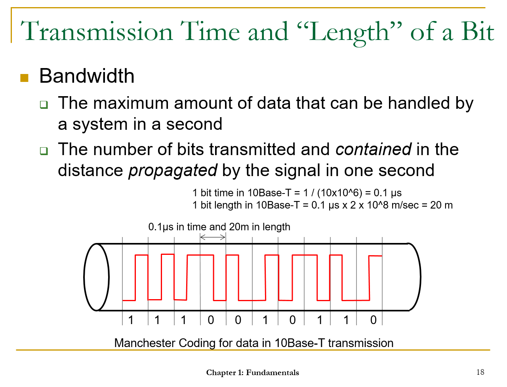
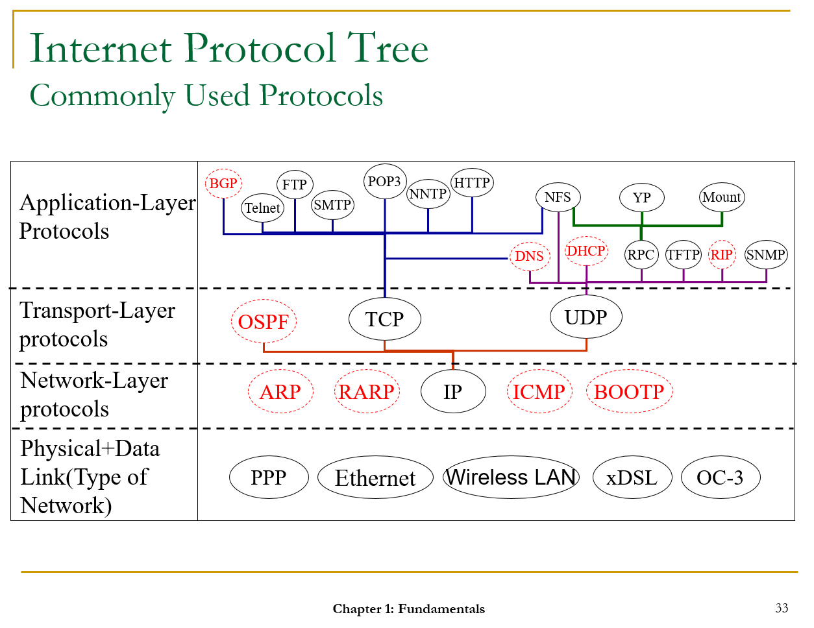
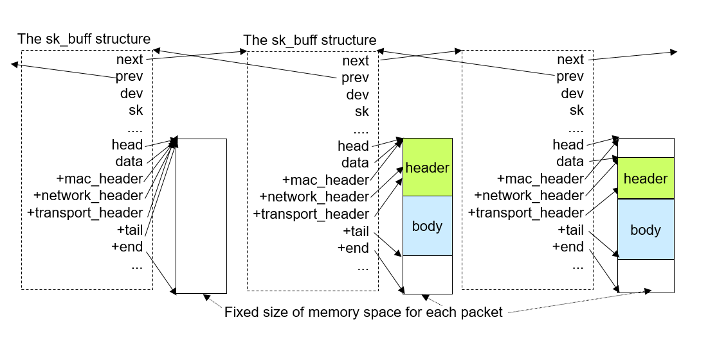
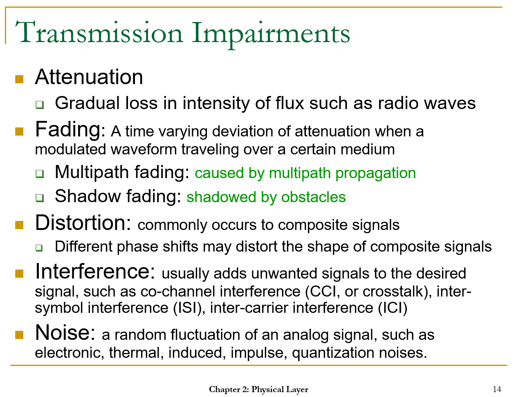
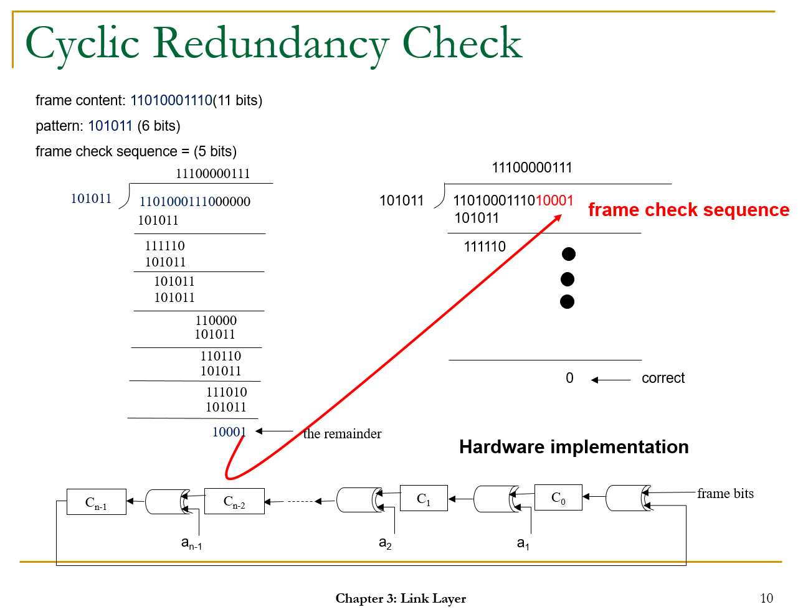

0. Introduction
=================

Course homepage: http://speed.cis.nctu.edu.tw/~ydlin/course/cn/mcn.html

1. Fundamentals
=================

1.1 Requirements
------------

**Requirements for Computer Networking**

Q: How do we frame a problem?
 >- objective: requirements
 >- constraints: principles

Q: What do we need to include in the solution
>- design: one architecture and many algorithms
>- implementation: code

Q: What do we ask about computer networks / 3 objectives of computer networks?
> - Connectivity: shared platform
> - Scalability: large number of users and applications
> - Resource-sharing: packet switching & circuit switching;  efficiency 
> *e.g. each party only talking half of the time on telephone calls*

**Connectivity: Node, Link, and Path (sequence of nodes and links)**

1. Node: host or gateway
- Host: end-point where users or applications reside
- Gateway: device to interconnect hosts

2. Link: point-to-point or broadcast
- Point-to-point: two end-points (full-duplex, half-duplex, simplex)
- Broadcast: many attach-points (need to contend for the right to transmit), normally shorter range

>Wired or Wireless
>- Wired: twisted pairs, coaxial cables, optics fiber etc
>- Wireless: radio, microwave, infrared, and beyond

3. Path: routed or switched
- Routed: stateless concatenation of links, [packet switching]
- Switched: stateful concatenation of links (hardstate vs softstate), [circuit switching]
*e.g. relationship state*

Switching is much faster than routing but at the cost of setup overhead (switching table)

 >- Circuit switching: indexing, telecom, eg ATM and phone call; switched
 >- Packet switching: matching, datacom, eg Internet and Skype call; routed

>Indexing is much faster than matching, but the overhead is that indexing needs to establish a much larger entry table. However, matching is more widely used, as matching has only the number of destinations as table entries, not the number of flows/connections as entries which is much larger. (In actual implementation, hashing is used to speed up the process).

>Circuit Switching Fall Back (CSFB): a compromise to handle both data and voice calls; propagation delay in packet switching *e.g. delay in international calls should be < 200ms, can be checked by ping or traceroute*

**Scalability: Number of Nodes**

Computer network: a scalable platform to *group* a *large* number of nodes so that each node *knows* how to reach any other node

*Hierarchy* of nodes (divide and conquer; currently 3-level;  4,000,000,000 nodes Internet, ~100,000 or 256*256=65,536 domain, and 256 destination sub-net etc), group by recursive clustering

LAN (local): broadcast link, switch
MAN (metropolitan): broadcast ring, routers
WAN (wide)

Intra-domain and inter-domain routing have different requirements for scalability, so the solutions will be different too

**Resource Sharing**

Computer network: a *shared* platform where the *capacities* of nodes and links are used to carry *communication* messages between nodes

Q: How to share?
> - Store-and-forward packet switching (vs circuit switching)
> - Packet the message (chop message into packets, header & payload)
> - Queuing/buffer, no blocking or dropping (vs circuit switching no queuing required, no packet loss or jitter/latency)
>  - at node: queuing/buffering and processing time
>  - at link: queuing/buffering, transmission, propagation time

bursty traffic, packet switching, possible congestion

1.2 Constraints / Underlying Principles
------------

 - Performance
 *quality of service*

	Keywords: Bandwidth, offered load, throughput, latency, jitter, loss

 - Operations
 *types of mechanisms*
	 - Operations at control plane **[managers]**

	Routing
	Traffic and Bandwidth Allocation

	 - Operations at data plane **[Assembly Line Workers]**

	Forwarding
	Congestion control
	Error control
	Quality of services

 - Interoperability (equipment from different vendors can operate together)
*what should be put into standard protocols and what should not*
	
	Standard protocols and algorithms
	Implementation-dependent (vendor-specific, can do it your own way)

**Performance Measures**

*Bandwidth*

Unit: 

 - MBps (million bytes per second)
 - Mbps (million bits per second)
 - Gbps (billion bits per second)

*Offered Load vs Throughput*

> Utilization: normalized offered load, bounded by 0 & 1 (but possible to exceed 1).
e.g. For a 10-Mbps link, an offered load of 5 Mbps means a normalized load of 0.5, meaning the link would be 50% busy on the average. 

- Offered Load: Input traffic
- Throughput: output traffic

The diagram shows a sub-linear relationship between offered load and throughput, with the non-linearity possibly due to collision (in a broadcast link) or buffer overflow (in a node or link).

*Latency: Node, Link, Path*

Propagation time = L/speed of signal
BDP = B * (propagation time)

*Jitter and Loss*

Jitter can be absorbed (by jitter buffer)

Link error (wifi has much higher error rate than Ethernet)
Node error (router been working for a long time without being shutting down)

**Operations at Control Plane**

*Control Plane vs Data Plane*

|Criteria | Control Plane | Data Plane|
|---------|---------------|-----------|
|Packets to process|Control packets only|All packets|
|Job|Background, eg resource allocation & error reporting|Foreground, eg table lookup & real time message transfer|
|Time scale|Milliseconds|Micro/nano-seconds|
|Performance|Utilization|Throughput|
|Operation|Routing (finding where to send packets)|Forwarding (sending packets)|

**Operations at Data Plane**

 - Forwarding
 - Classification
	 - Forwarding
	 - Packet filtering
	 - Encryption
 - Error Control
 - Traffic control
	 - Flow control (bottleneck is the receiver)
	 - Congestion control (bottleneck is the network)
 - Quality of Service
 

**Interoperability**

*Standard Protocol*

>Example:
>1. If two neighboring routers A and B use different routing algorithms to compute their shortest path to destination X, it is possible that A would point to B as the next hop of the shortest path to X, and vice versa for B, resulting in looping between A and B.
>2. Data sender and receiver need to use the same algorithm for encoding and decoding. 

*Implementation-Dependent Protocol*

>Example:
>Dijkstra's routing algorithm may have different calculation implementation that follows the same logic 

1.3 The Internet Architecture
------------

The Internet is one of the solutions that achieves the requirements (connectivity, scalability, resource sharing) and follows the principles.

It defines the "design" part of the solution, while later in section 1.4 we will discuss the solution "implementation".

Other common solutions: 

 - Asynchronous Transfer Model (ATM)
 - Multi-Protocol Label Switching (MPLS)

**Solutions to Connectivity**

Q: Why stateless and connectionless (routing)?
> It requires a huge amount of memory usage for switching devices to memorize the state information. It is inefficient for bursty traffic, or short lived connection (overhead cost in establishing the connection).

Q: What is the End-to-End argument?

>  - Hop-to-hop error control only guarantees correctness of link, but nodes are not error-free
>  - End-to-end error and traffic control: for end hosts, guard against nodal errors
>  - The argument: do not put the error control in a lower layer unless it can be completely done there
>  - Hop-to-hop control is still used for performance optimization (faster error detection)
> The end-to-end argument has also pushed complexity toward the *network edge* while keeping the network core simple enough to scale well 

Q: What is the Four-Layer Protocol Stack?
> Abstraction -> layererd protocols -> lower layers hide details from upper layers
> Four-layer Internet architecture (TCP/IP architecture)

(The protocols marked with dotted circles are control plane protocols, while the rest are data plane protocols.)

Dumb-bell shape / the evolving hourglass

**Solutions to Scalability**

Q: What are the fundamental design problems to be answered?
> 1. How many levels of hierarchy
> 2. How many entities in each hierarchy
> 3. How to manage this hierarchy

*The Internet adopts a three-level hierarchy with subnet as its lowerst lavel, autonomous system (AS) as middle level, and many ASs in the top level.*

*Subnet*

Definition: nodes in a physical network with a contiguous address block

Keywords: subnet, netmask, prefix

*Autonomous System (AS)* 

Keywords: intra and inter AS routers

Example: NCTU network

**Solutions to Resource Sharing**

Q: What are the issues on resource sharing?
>1. Compared to telecommunications, which is primarily used for telephony only, data communications has a large variety of applications, thus require multiple types of connectivity.
> 2. Congestion due to packet switching requires congestion control and flow control

*Common Best-Effort Service: IP*

The applications could be categorized into at least three types: interactive (response), file transfer (traffic), and real-time (both). 

"Best-effort delivery" describes a network service in which the network does not provide any guarantees that data is delivered or that a user is given a guaranteed quality of service level or a certain priority.

If the decision is to have a type of connectivity to support each application category, the routers inside the Internet would be type-aware so as to treat packets differently. However, the Internet offers one single type of connectivity service, namely the best-effort IP service.

*End-to-End Congestion Control and Error Recovery: TCP*
 
Keywords: polite, reliable

UDP is another end-to-end protocol, though it is quite  primitive , with only a simple checksum for error detection, but no error recovery or traffic control.

Traffic control:  UDP and TCP still can coexist, because UDP only exists in a small percentage (less than 10%), and it continues to drop (especially because streaming has been changed to TCP, as it is soft-real time, re-transmitting from TCP helps with streaming output quality); VoIP still needs UDP though as it is hard-real time.

TCP -- AIMD (Additive increase, Multiplicative decrease):
	analogy: driving a car, start gradually and linearly, but break quickly

1.4 Open Source Implementation
------------

Solution Design: the Internet [Open Standard/Open Interface]

Solution Implementation: many, eg open source like Linux, VxWorks, Junos, IOS [one step further: Open Source/Open Implementation]

Some figures: more than 80% of the servers run on Linux

**Battle between open and closed source**

Q: Open Implementation or Open Interface?

> Windows adopts open interface to allow third-party developers to build applications, but not Apple at that time;
> Android (Linux+VM) not only opens interface, it opens mplementation too
> IBM has a proprietary System Network Architecture (SNA) that is patented and prevents interoperability

Virtues of open interface

 - Interoperability

Virtues of open implementation

 - World-wide contributors
 - Fast updates and patches
 - Better code quality (users may debug)

**Software Architecture in Linux Systems** 

Kernel Space vs User Space

Keywords: system call, software interrupt

**Book Roadmap: A Packet's Life**

Aim:

 - Explain the detailed why and how in each layer of the protocol stack
 - Address the two pressing issues on the Internet: QoS and security

Concept:

 - sk_buff: a data structure used to store and describe a packet, so that each module can pass or access the packet simply by a memory pointer

 -  alloc_skb( ): The routine called when a packet is received from a network device, to allocate a buffer for the packet
 - skb_put( ): Move the pointer tail toward the end and the three header pointers to their corresponding positions
 - skb_pull( ):  move down the pointer data every time when a protocol module removes its header and passes the packet to the upper-layer protocol 
 -  kfree_skb( ):  Return the memory space of the sk_buff 

Internet -- huge application -- most significantly World Wide Web, email, telnet/remote login, Finger (check if another user is online), Talk, Social Networking, and IoT

Bonus: Network Cloudification
-----------------------------

[Lecture slides](./Network_Cloudification.pptx)

In the past, cloud computing only happened to server devices, not client devices.

Enterprise used to own their own machine rooms for servers with in-house IT personnel. Now, most enterprise rent virtual machines on cloud-based servers, maintained by cloud operators.

We may cloudify the control plane and some parts of the data plane, and leave only simple hardware with the enterprise.

The 2nd wave of cloud computing is turning appliances to apps.

Analogy: chop off your hand and surrender some of your organs to the cloud.

Advantages of cloud computing:

 -  cheaper device
 - scalability
 - job opportunity shift from IT maintenance to cloud
(part of communication jobs will be turned into computing)

The delay constraint (minimum speed required) defines if a job can be cloudified 

Terms:

 - Central Office Re-architected as a Datacenter (CORD)
 - Software-Defined Networking (SDN)
 - Network Functions Virtualization (NFV)

Problem of having too many network functions in cloud is too many detours -- like blood detour to remote kidney, heart, and lungs -- so the aim is to detour at most once.

Appendices
----------

[Lecture slides](./Appendices.ppt)

2. Physical Layer
=================

The transmission media can only carry signals instead of data, but the information source from the link layer is of digital data. Thus the physical layer must convert the digital data into an appropriate signal waveform.

**2-Step Process**

1. Apply information coding to the digital data for data compression and protection (not used for analog communication);
2. Modulate the coded data into signals that are appropriate for transmission over the communication medium.

Medium--channels--multiplexing (resource sharing)

2.1 General Issues
------------------

**Data vs Signal: Analog vs Digital**

-  Both data and signal can be either analog or digital
-  Signal can be either periodic or aperiodic
-  Analog: continuous, long distance and wireless transmission, more easily affected by noise
-  Digital: disdrete, short distance and wired transmission
-  Data: value
-  Signal: information

**Nyquist Theorem vs Shannon Theorem**

- Nyquist: noiseless channel
	- Nyquist sampling theorem: fs ? 2 x fmax
	- Maximum data rate: 2B*log2*L (B: bandwidth, L: # states to represent a symbol)

- Shannon: noisy channel
	- Maxium data rate: B*log2*(2(1+S/N)) (B: bandwidth, S: signal, N: noise)

**Transmission and Reception Flows**

>Source Coding vs Channel Coding

> - Source coding: compression
> - Chennel coding: add redundancy, noise error fixing

**Baseband vs Broadband**

 - Baseband: digital signal transmission
 - Broadband: analog signal transmission (digital to analog waveform conversion by **modulation**), can transmit multiple signals
> modulation:
> Use analog signals, characterized by amplitude, frequency, phase, or code, to represent a bit stream.
A bit stream is modulated by  a carrier signal into a bandpass signal (with its bandwidth centered at the carrier frequency).

**Line Coding**

Also known as digital baseband modulation, it is a widely used coding technique for physical layer.

 -  Synchronization: between receiver's and transmitter's clocks
	 - loss of synchronization if long sequence of same bit value
 -  Baseline wandering/Drift: make starting time to be the same
	 -  hard for a decoder to determine the digital values of a received signal
 -  DC components/DC bias: non-zero component around 0Hz due to coding techniques such as non-return-to-zero (NRZ), balance between positive and negative signal level to save power

In summary, the major goals of line coding are preventing baseline wandering,  eliminating  DC components, activating self-synchronization, providing error detection and correction, and enhancing the signal’s immunity to noise and interference.  

**Transmission Impairment**

2.2 Medium
------------------

**Wired Medium**

 - Twisted Pair: prevent electromagnetic interference; telephone & Ethernet
 -  Coaxial Cable: cable TV & Internet
 -  Optical Fiber: straignt line or reflection, minimizing refraction

**Wireless Medium**

- Propogation methods: ground, sky, line-of-sight
- Transmission waves: radio, microwave (mostly used for mobility), infrared waves

2.3 Information Coding and Baseband Transmission
------------------------------------------------
Coding is a process that converts an information source into symbols, and vice versa for decoding.

 - Source Coding: compression, application layer
	 - e.g. JPEG, CD, DVD, MP3

 - Channel Coding: error correction, physical & link layers

 - Line Coding: digital data to digital signals, deals with baseline wandering & loss of synchronization & DC components

**Line Coding**
Line coding is a process that applies pulse modulation to a binary symbol, and a pulse-code modulation (PCM) waveform is generated. 

 - Self-synchronization
 - Signal to data ratio (sdr)
 - Line coding schemes
	 - unipolar (V, zero): DC-unbalanced, demand more power
	 - polar (V, -V)
	 - bipolar (V or -V, zero)

2.3 Digital Modulation and Multiplexing
------------------------------------------------

Digital signals  ----sinusoidal carriers of higher frequency--->  analog (for transmissions over higher-frequency channels)

**Amplitude-Shift Keying (ASK)**
uses different levels of amplitude of carriers to represent digital data. 
Binary ASK (BASK): two levels of amplitudes

**Others**

 - Frequency-Shift Keying (FSK) 
 - Phase-Shift Keying (PSK)

**Multiplexing**

Using channel access methods, multiple transceivers can share a transmission medium. 

**Code Division Multiple Access (CDMA)**

Synchronous CDMA uses orthogonal codes, while asynchronous CDMA uses PN codes. 

3. Link Layer
=================

Q: Why do we need the link layer?
 > Several issues need to be addressed by a set of functions above the physical link, such as:
 > 
 > - Cross-talk noise between adjacent link pairs can unexpectedly impair transmission signals and result in errors, so the link layer needs proper error control mechanisms for reliable data transmission.
 > - The transmitter might transmit at a rate faster  than what the receiver can handle, and has to slow down if this situation happens notify the receiver where the source of the packets is.

3.1 General Issues
------------------

- **Framing**: header + payload; convert between frames and bits (for physical layer transmission)
	- bit-oriented: 01111110 in High-Level Data Link Control (HDLC)
	- byte-oriented: SOH (start of header) and STX (start of text)
	- bit- or byte-stuffing: DLE (data link escape)
- **Addressing**: identify host
	-  EEE 802 MAC Address standard
	-  Organization-Unique Identifier (OUI) and OrganizationAssigned Portion, 3 byte each
	-  The first bit in transmission order is reserved to indicate whether the address is unicast or multicast (eg broadcast: all 1's) 
	- Transmission order: little-endian (least significant bit first) & big-endian (most significant bit first)
- **Error control and reliability** 
	-  checksum and cyclic redundancy check (CRC)

	- 
	- Acknowledgement: silently discard [Ethernet]; positive acknowledgement [wireless]

- **Flow control**: fast transmitter and slow receiver
	- Stop-and-wait
	- Sliding window protocol
	- More: e.g. back pressure and PAUSE frame
- **Medium access control (MAC)**: sharing of common physical medium; who gets to transmit next
	- Contention-based approach
	- Contention-free approach
- **Bridging**: Connecting separate LANs into an interconnected network
	-  Spanning tree protocol (STP) implemented to eliminate loops in a bridged network

3.2 Point-to-Point Protocol
---------------------------

**3.2.1 High-Level Data Link Control (HDLC)**

*Medium Access Control*

- Normal response mode (NRM): secondary passive transmit in response to primary's poll
-  Asynchronous response mode (ARM): secondary initiation is possible
-  Asynchronous balanced mode (ABM): both are both primary and secondary

**3.2.2 Point-to-Point Protocol**

PPP vs HDLC frames

**3.2.3 Internet Protocol Control Protocol (IPCP)**

**3.2.4 PPP over Ethernet (PPPoE)**
Multiple users on an Ethernet LAN access the Internet through the same broadband bridging devices, so service providers desire a method to have access control and billing on a  per-user  basis, similar to conventional dial-up services.

PPPoE creates a  virtual interface  on an Ethernet interface so that each individual station on a LAN can establish a PPP session with a remote PPPoE server, which is located in the ISP and known as  Access Concentrator  ( AC ), through common bridging devices.

*PPPoE Operations*

 - Discovery stage: discover the MAC address of the access  concentrator
 - PPP session stage: similar to it in normal PPP session

3.3 Ethernet (IEEE 802.3)
---------------------------
"Carrier sense multiple access with collision detection (CSMA/CD) access method and physical layer specification."

- sense if carrier is busy or bursty (not full-duplex)
- Inter-frame gap (IFG)
- Collision detected: jam signal, abort, back-off time (0 ~ 2^k - 1), k=min(n, 10), reattempt, max attempt and abort frame

3.4 Wireless Links
---------------------------

Wireless vs Wired:
>- Less reliability (interference, path loss, or multipath distortion)
> - More mobility (wirelessness not equal to mobility)
> - Less power availability (sleep mode, buffer data, awake)
> - Less security (eavesdrop within the transmission range)

**3.4.1 802.11 wireless LAN**
Terms:

-  Basic service set (BSS) 
-  Distribution system (DS) 
-  Access point (AP) 
- Distributed coordination function (DCF)  
- Point coordination function (PCF)
- Carrier sense multiple access with collision avoidance (CSMA/CA)
	- different from collision detection
	- Collision detection in WLAN is difficult to implement: the cost of 
 full-duplex radio frequency is high, and potentially hidden stations make collision detection fail (hidden terminal problem) 
- Inter-frame space (IFS): 
	- same as inter-frame gap (Ethernet collision): no random back-off
	- analogy: freezing / cool down period of three weeks to consider if to file the divorce contract
- Contention window (CW): backoff time   
- Request to send (RTS) & clear to send (CTS): virtual carrier sense
	- RTS: send a small frame asking the carrier to have a clean period, before sending the large frame;
	- CTS: respond from receiver to let all other packages know about the collision free period reserved; so others will not send during this period;
	-  Furthermore, the RTS/CTS mechanism is only applicable to  unicast  frames. In the case of multicast and broadcast, multiple CTSs from the receivers will result in a collision.

-  Point coordinator (PC)
	- contention-free period (CFP)
	- polling 

**3.4.2 Bluetooth (Wireless PAN)**

*Master and Slaves in Piconet and Scatternet* 
>Multiple devices sharing the same  channel  form a **piconet**, consists of exactly one master and multiple slaves;

>The master has the authority to control channel access in the piconet, say, deciding the hopping sequence. The slaves can be either active or parked, and a master controls up to seven active slaves at the same time;

>Parked slaves do not communicate, but they still keep  synchronized  with the master and can become active as the master demands;

>For more devices to communicate simultaneously, multiple piconets can  overlap  with one another to form a larger **scatternet** with a **bridge** node

*Inquiry and Paging Procedures* 
> Inquiry: discover each other
> Paging: build up the connection

 *Interleaved Reserved and Allocated Slots* 
Synchronous connection-oriented link (SCO link)
 Asynchronous connectionless link (ACL link)

**3.4.3 WiMAX (Wireless MAN)**
WiMAX (Worldwide Interoperability for Microwave Access), IEEE 802.16 

Developed for broadband connections over a distance of miles

WiMAX uses a scheduling algorithm to allocate bandwidth among the devices,  more appropriate for time-sensitive applications such as VoIP

Uplink / downlink

3.5 Bridging (IEEE 802.1D)
---------------------------
MAC bridge, layer-2 switch

Almost all bridges are transparent bridges because all stations on the interconnected LANs are unaware of their existence.

The bridge has ports to which LANs are connected. Each port operates in the 
promiscuous mode, meaning it receives every frame on the LAN attached to it, no matter what the destination address is.

**3.5.1 Self-Learning**

Address table/forwarding table, map MAC address to port number

To ensure that the destination can receive the frame, it simply broadcasts the frame to every port except the port where the frame originates.

*Aging* mechanism to prevent stale entries

*Multicase pruning*

Repeater hub, layer-1 device

Cut-through (forward before completely receive frame) vs store-and-forward (new "switch")

**3.5.2 Spanning Tree Protocol**

Prevent loops in topology

**3.5.3 Virtual LAN (IEEE 802.1Q)**

3.6 Device Drivers of a Network Interface
-----------------------------------------

Half-duplex Ethernet not efficient, long waiting time for carrier extension and frame bursting

Ethernet switch
 - Switch: physical switch; each port is a collision domain; transmission on one port will not collide with the other
 - Hop: internal bus; collision domain = broadcast domain

**Spanning Tree Protocol**

To find out the root & the direction: send "Hello", if receives "Hello" from port that has ID smaller than own ID, stop sending "Hello". At the end only one port will be sending "Hello" and that is the root. (Distributed algorithm)

**Self-Learning Switches**

Advantage:
-  plug and play, no need much configuration
Disadvantage:
 - need to enforce a spanning tree with a sub-optimal path 
 - scalability, a lot of "frothing"

Drivers
-------

Analogy: if it is a quick question (fast interrupt), the prof can answer it right away; if it is a long question on difficult topic, the prof will request the student to book an appointment slot.

Interrupt vs polling:
polling can suppress interrupt, and ask for more interrupt
Analogy: interrupt is when a student raise her hand to ask a question; polling is the teacher asking "do you have any question" without waiting for an interrupt

per-frame interrupt vs per-burst interrupt
burst is a sequence of frames that come continuously

Only interrupt-driver for the first frame, and change to polling for all subsequent frames

4. Network Layer
=================
Internet Protocol Layer

IP Layer General Issues
--------

 - Service: host-to-host transmission, best effort, connectionless, next-hop forwarding
 - Addressing: hierarchical address instead of flat address like Ethernet
	- Flat address is like an ID, like selling a car and not knowing where the user will be, it is self-determined
	- Hierarchical address is more like a real address, like selling a house and knowing its location, it is assigned
 - Routing [control plane]: compute the table
	- Issue with IP multicast: turning router from stateless to stateful and slow it down
	- Instead of having router doing multicast, the solution is to use a server to do multicast, and this is done in the application layer instead of internet protocol / transport layer
 - Forwarding [data plane]: look up the table
 - Security

**Bridging vs Routing**
 - Bridging: plug and play 
 - Routing: shortest path, as no logical spanning tree is enforced; larger topology size as self learning has size restrictions (better scalability)

Data Plane Protocols
-----------------

Classless IP address

ICANN: administrator for IP address and domain name; Internet Corporation for Assigned Names and Numbers

Cashing and FIB table
>Analogy for longest match address: when hunt for a wife, sort possible girls by criteria and date the first in the queue, and move on to the next
Count /  match from the highest bit first, until a match is found. This first match will be the longest match.

Fragment control

Network Address Translation (NAT), private IP addresses

IPv4 vs IPv6

Control Plane Protocol
-----------------

**Address Management**
Address Resolution Protocol (ARP), Reverse ARP (RARP)
(MAC address, IP address) pair

**Address Configuration**
Dynamic Host Configuration Protocol (DHCP)
Automatically assign IP address to host

**Error Reporting**
Internet Control Message Protocol (ICMP)
Error and status of TCP/IP
ICMPv4 vs ICMPv6

**Routing**
Intra-domain

 - Routing Information Protocol (RIP)  
 - Open Shortest Path First (OSPF)

Inter-domain

- Border Gateway Protocol (BGP)

**Routing Principle**

 - Link State Routing (Dijkstra Algorithm), global information
 - Distance Vector Routing (Bellman-Ford Algorithm), local information with neighbours

Hierarchical Routing
Autonomous Systems (AS)

**Membership Management**
Internet Group Management Protocol ( IGMPv2)

**Multicast Routing Protocols**

>- IP multicast routing is a failure; it is only used within a domain
- It is because it impose huge burden to routers, and it turns stateless routers to be stateful.
- Solution: application to do multicast instead of routers

Send one copy, being duplicated, to send to n receivers

 - DVMRP (Source-based, one tree per source)
 - PIM-SM (Core-based, only one tree)
 - SSM  
 - MSDP  
 - Anycast RP

5. Transport Layer
=================
End-to-end protocol layer

>- Link layer: **node-to-node** single-hop communication channels between directly linked nodes;
- IP layer: **host-to-host** multi-hop communication channels across the Internet;
- Transport layer: **process-to-process** communication channels between application processes on different Internet hosts.

The sophisticated Transmission Control Protocol (TCP) [connection oriented and stateful] and the primitive User Datagram Protocol (UDP) [impolite].

Flow control (source--destination) vs Congestion control (source--network)

TCP Congestion Control
----------------------
 A TCP sender is designed to infer network congestion by detecting loss events of data segments. After a loss event, the sender politely slows down its transmission rate to keep the data flow below the rate that would trigger loss events. This process is called  congestion control.

 1. Slow start
 2. Congestion avoidance
 3. Fast retransmit
 4. Retransmission timeout
 5. Fast recovery

TCP Performance
---------------

**Performance Problem of Interactive TCP: Silly Window Syndrome** 

When it occurs, small packets are exchanged across the connection, instead of full-sized segments, which implies more packets are sent for the same amount of data. 

Header overhead cost as well.

**Performance Problem of Bulk-Data Transfers** 

 Bandwidth delay product (BDP) or the pipe size

Filling of the piple is not effective utilization of the network 

- The ACK-Compression Problem 
- TCP Reno’s Multiple-Packet-Loss (MPL) Problem 

since the receiver always responds with the same duplicate  ACK, the sender assumes at most one new loss per RTT. Thus, in such a case, the sender must spend numerous RTTs to handle all of these losses. 

Results in eventual retransmission timeout

Real-time Transport Protocol (RTP)
----------------------------
RTCP: the auxiliary control protocol for getting feedback on quality of data transmission and information about participants in the ongoing session

Special parts in RTP header:

 - timestamp
 - sequence number
 - Synchronization Source Identifier (SSRC)

6. Application Layer
=================
**Driving force** for creating new applications: 

- human-machine communication (accessing data and computing resources)
- human-human communication (message exchange)
- machine-machine communication (e.g. peer-to-peer(P2P) applications & IoT)

Internet applications can be categorized as interactive, file transfer, or real-time,  each placing different **requirements** on latency, jitter, throughput, or loss.

- TCP& UDP ports
- Servers
	 1. Iterative connectionless [Common]
	 2. Iterative connection-oriented    
	 3. Concurrent connectionless
	 4. Concurrent connection-oriented [Common]

- Stateful: connection, responsibility
- Stateless: efficiency & scalability
- Iterative: short service time
- Concurrent: prolonged service time

- Application layer protocols
	- Variable message format, length, and data types (ASCII instead of binary)
	- Stateful (FTP, SMTP) or stateless (HTTP, DNS)

Domain Name System (DNS)
------------------------

Electronic Mail (e-mail)
-------------------------------------------------
- Mail Transfer Agent (MTA), Mail Delivery Agent (MDA), Mail Retrieval Agent (MRA)
- FC 822—Internet Message Format 
- Multipurpose Internet Mail Extensions (MIME) 

**Internet Mail Protocols**

- Simple Mail Transfer Protocol (SMTP)
- Post Office Protocol Version 3 (POP3) 
- Internet Message Access Protocol Version 4 (IMAP4) 
	- Browser based instead of downloading

World Wide Web (WWW)
--------------------
**Web Naming and Addressing**

Uniform Resource Identifier (URI)
Uniform Resource Locator (URL)
Uniform Resource Name (URN)

File Transfer Protocol (FTP)
----------------------------
**Active mode (server perspective)**
Control connection is initiated by the client while the data connection is initiated by the server

 **Passive Mode**
 Both connections are initiated by the client (resolving firewall problem)
 

Simple Network Management Protocol (SNMP)
-----------------------------------------
Designed for network administrators

A more systematic infrastructure than ping, traceroute, or netstat 

Management Information Base (MIB)

**SNMP Basic Components**

- Management Station
- Agent
- Managed Object
- Managed Device
- Management Protocol

 Poll-Based and Trap-Based Detection 

Voice Over IP (VoIP)
--------------------

Streaming
--------------------
Compression

Real-Time Streaming Protocol (RTSP) 

Audio and video synchronization

Peer-to-Peer Applications (P2P)
-------------------------------

7. Quality of Service Control
=================

Introduction
------------

**Problem statement**

No QoS in Internet currently (it is a freely competitive network with stateless core where only Best Effort is supported by IP), especially for non-TCP-friendly real time applications where TCP end-to-end congestion control is absent.

- routers do fast forwarding without checking packet or destination
- all packets inserted in same queue until overflow
- packet sent out sequentially at maximum rate

**Aim**

 - low/bounded delay
 - low loss rate
 - low jitter
 - particularly focused on wireless network & server QoS

QoS Architecture
--------------------

**Integrated Services (IntServ)**
	
 - virtual private path 
 - guaranteed bandwidth reservation and delay
 - multiple per-flow router queues
 - not scalable

Service Types:

 1. Guaranteed (eg VoIP)
 2. Control Load (eg streaming)
 3. Best Effort (eg web browsing)

**Differentiated Services (DiffServ)**

 - per-class handling
 - different forward behaviors according to service classes
 - not widely deployed in the global Internet yet
 - ingress or egress edge routers (identify and mark; police and shape) & core routers
 - DS field in IP header

PHB (per-hop behaviors) Groups:

 1. AF (Assured Forwarding)
  traffics that are bursty but tolerant of packet loss
 2. EF (Expedited Forwarding)
  traffic with a constant bit rate and high quality requirement
 3. Best-Effort

**Comparing IntServ and DiffServ**

DiffServ

Pros: simpler; solves the difficulty of classifying and scheduling a huge number of packets in core routers (semi-stateful: only edge routers are stateful)

Cons: no on-demand reservation; users have to sign a contract with the service provider; limit forwarding classes with possible aggregation; core routers do not classify

Total Solution to QoS
---------------------

Algorithms for QoS Components

**Control Plane**

 - Signaling Protocol
	 - negotiate with a router for resource reservation
	 - Resource ReserVation Protocol (RSVP)
	 - Common Open Policy Service (COPS)

 - QoS Routing
	 - provide expected arrival time 
	 - select path based on distance, bandwidth, delay, and loss ratio 

 - Admission Control
	 - deployed at gateway routers
	 - comparing required vs available resources
	 - statistics-based and measurement-based (exponentially weighted moving-average (EWMA))

**Data Plane**

- Classification
	- classify packet into a particular flow or class
	- tradeoff between space and time: binary tree, mapping, hashing

- Policing
	- monitor the traffic
	- mark, drop, or delay some packets
	-  token bucket mechanism (token stream, leaky bucket)
	- flexibility: mean rate, maximum rate, burst

- Scheduling
	- enforce resource sharing between different flows or classes
	- a.  buffer management within a queue
	- b. resource sharing among multiple queues
	- algorithms -> fair queuing (worst-case delay bound)  
		- round robin based
			- weighted round robin (WRR)
			- deficit round robin (DRR) -- long timescale and jitter
		- sorted based
			- generalized processor sharing (GPS) for virtual fluid model
			- weighted fair queuing (WFQ),  virtual finish timestamp (VFT)

**Others**

- Packet Discarding
	- Tail drop; longest queue tail drop (LQTD)
	- Early drop, warning, avoid consecutive dropping

8. Network Security
=================

Due to Internet's accessibility, security becomes a main concern

Three main parts of security:

8.1 Data security
-----------------
Cryptography
	
**Symmetric Key System** 

 - DES (Data Encryption Standard)
 	 Only 56 bits, and it is possible to crack the key with brute force.
 
 
 - 3DES (Triple-DES)
Three times more expensive in computation

 - AES (Advanced Encryption Standard); problem: may be hacked, hard to ensure the secrecy of common key; brute force may decode or guess the key 
 Newer: 2001, easier software impelementation

**Asymmetric Key System**

RSA ((Rivest, Shamir, and Adleman), private and public key, CA to sign the public key and issue certificate, use it together with AES for efficiency

**Authentication**

- Digital Signature
- MD5 (Message Digest algorithm 5)
- plain text, hashing, private key encryption, compare two hash values

**Application to VPNs (Virtual Private Networks)**

*Link Layer*: Tunneling
Packet encapsulation, private communication tunnel, NAS (network access server)
>L2TP (Layer 2 Tunneling Protocol)
>PPTP (Point-to-Point Tunneling Protocol)
	
*Network Layer*: IPsec (IP Security)

 - Security Association (SA): establish a **unidirectional** connection of secure transfer

 - Authentication Header (AH): integrity and authentication of data
	- MD5 algorithm 
	- Basically, compute a message and compare with the message sent from sender

 - Encapsulation Security Payload (ESP): secure data transfer

 - Key Management
	 - SKIP (Simple Key management for IP)
	 - ISAKMP/Oakley (Internet Key Exchange, IKE)

*Transport Layer*

- SSL (Secure Socket Layer)
	Green symbol beside URL
	Historical evolution: HTTP Secure (HTTPS) and Secure Shell (SSH) 
- SET (Secure Electronic Transaction)
	E-commerce, online payment
	SET will not give the credit card number to the seller, so the seller cannot abuse the number

8.2 Access security
-------------------

**Bidirectional** control (security and policy reasons) 

**Firewall System**
Rule matching
Filter and report the content accessed

- Packet filter-based firewall [fast]
- Application gateway-based firewall [slower but more accurate]
	- need to assemble packets
	- need to be stateful
	- scanning is harder than matching
	- slow firewall may be performance bottleneck

8.3 System security
-------------------

**Vulnerability** be exploited

- Intrusion detection
	- pros: faster, no false positives
- Intrusion prevention
	- pros: alert will not be dropped, miss unknown attacks, will block attacks

**Malwares**
Wild propagation of malicious programs
Buffer overflow

 1. Information gathering
		 Scanning, sniffing, social engineering
 2. Vulnerability exploiting
		 Remote and local vulnerabilities, password cracking, denial of service (DoS)
 3. Malicious code
		 Virus, worm, trojan, backdoor, bot
 4. Typical defenses
		 Auditing, monitoring, intrusion detection and prevention, anti-spam
